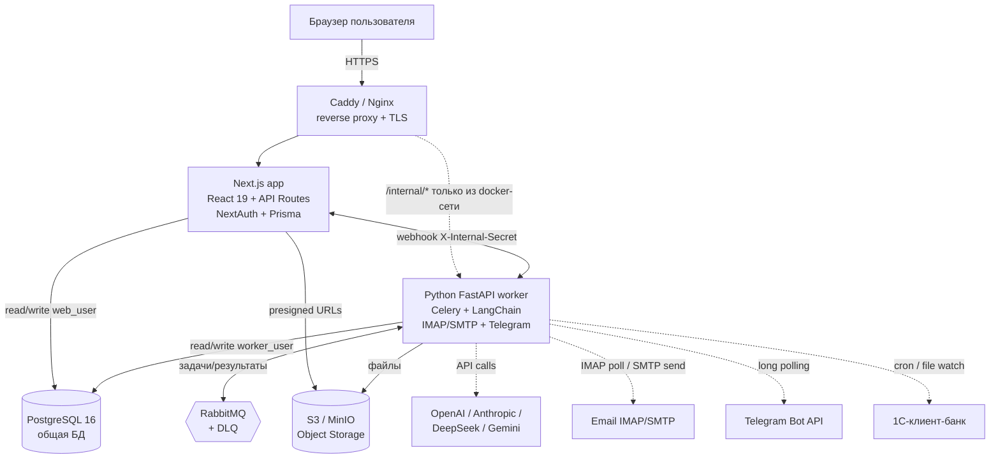
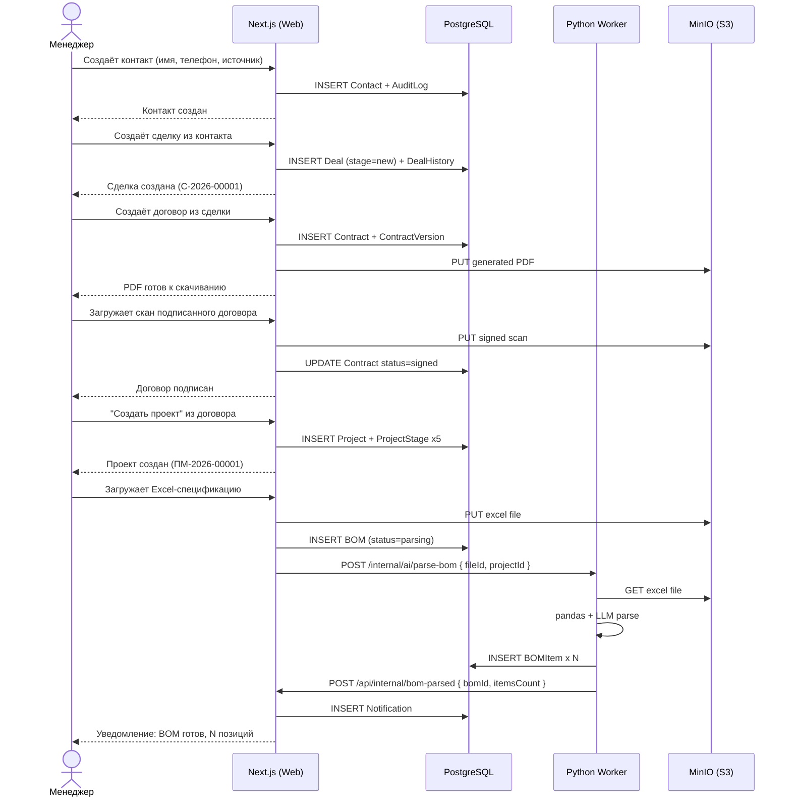

# 03. Целевая архитектура

## 3.1. Архитектурный стиль

Целевая система строится как **модульный монолит** (modular monolith) с гибридным backend: один процесс Next.js (основной API + UI) и один процесс Python FastAPI (воркеры AI/email/Telegram), разделяющие одну базу данных PostgreSQL. Выбор в пользу монолита, а не микросервисов, обоснован:

- Транзакционная консистентность между CRM, закупками и финансами критична (нельзя допустить, чтобы договор создался в CRM, а проект в закупках — нет).
- DevOps-накладные расходы на микросервисы не оправданы при размере команды 4–6 человек.
- Модульная структура с чёткими границами (Bounded Contexts) позволит в будущем вынести AI-воркер в отдельный сервис, если нагрузка вырастет.
- Операционно система рассчитана на 10–50 одновременных пользователей — это не требует горизонтального масштабирования.

## 3.2. Высокоуровневая схема

```
┌─────────────────────────────────────────────────────────────────────────┐
│                          Браузер пользователя                          │
└───────────────────────────────────┬─────────────────────────────────────┘
                                     │ HTTPS
                                     ▼
                          ┌───────────────────────┐
                          │   Caddy / Nginx       │ ← reverse proxy + TLS
                          │   (auto-HTTPS)        │
                          └──────────┬────────────┘
                                     │
                  ┌──────────────────┴──────────────────┐
                  │                                     │
                  ▼                                     ▼
   ┌──────────────────────────┐         ┌──────────────────────────────┐
   │  Next.js (Node.js/Bun)   │         │  Python FastAPI Worker       │
   │  ─ Frontend (React 19)   │         │  ─ AI Agent (LangChain)      │
   │  ─ API Routes (CRUD,     │         │  ─ Email Worker (IMAP/SMTP)  │
   │    бизнес-логика)        │         │  ─ Telegram Bot              │
   │  ─ NextAuth (JWT)        │         │  ─ Celery Tasks              │
   │  ─ Prisma ORM            │         │  ─ SQLAlchemy ORM            │
   └────────────┬─────────────┘         └─────────────┬────────────────┘
                │                                     │
                │      ┌──────────────────────┐       │
                │      │   RabbitMQ (broker)  │◄──────┤ задачи через Celery
                │      └──────────┬───────────┘       │
                │                 │                   │
                └────────┬────────┴─────────┬─────────┘
                         │                  │
                         ▼                  ▼
              ┌──────────────────────────────────────┐
              │       PostgreSQL 16 (общая БД)       │
              │  ─ 30+ таблиц, единая схема          │
              │  ─ JSONB для динамических атрибутов  │
              │  ─ Row-Level Security (опционально)  │
              └──────────────────────────────────────┘
                         │
                         ▼
              ┌──────────────────────────────────────┐
              │       Object Storage (S3/MinIO)      │
              │  ─ вложения email, PDF-договоры,     │
              │    сканы, выгрузки из 1С             │
              └──────────────────────────────────────┘
```

### 3.2.1. Mermaid-диаграмма (рендерится в GitHub)



### 3.2.2. Mermaid: поток данных (от контакта до проекта)



## 3.3. Контуры системы

### 3.3.1. Web App (Next.js)

**Ответственность:** UI всех модулей, REST API для CRUD-операций и UI-связанной бизнес-логики, аутентификация, авторизация, audit, валидация ввода.

**Состав:**
- App Router pages: страницы модулей (CRM, Сделки, Договоры, Проекты, Закупки, Финансы, Аналитика, Настройки).
- API Routes: эндпоинты под каждым модулем, общие эндпоинты (auth, users, audit, search, notifications, health).
- Middleware: проверка JWT, RBAC-проверки, rate limiting, CSRF, sanitization.
- Server Components: рендеринг списков, дашбордов (выгоды SSR — меньше клиентского JS).
- Client Components: интерактивные элементы (Kanban с DnD, формы с валидацией, таблицы с фильтрами).

**Принципы:**
- Все обращения к БД — только через Prisma client (никаких сырых SQL вне миграций).
- Бизнес-логика в отдельных сервисах (`src/lib/services/*`), не в route-хендлерах.
- Валидация ввода — zod-схемы, общие для клиента и сервера.
- Audit log на все мутации (create/update/delete) — через Prisma middleware или явные вызовы в сервисах.

### 3.3.2. Python Worker (FastAPI)

**Ответственность:** AI-задачи, email-воркер, Telegram-бот, парсинг Excel/PDF, тяжёлые фоновые процессы.

**Состав:**
- FastAPI app с health-эндпоинтом и minimal admin (для ручного запуска задач).
- Celery workers: `ai_worker` (парсинг BOM, сверка счетов), `email_worker` (IMAP polling, SMTP отправка), `bank_worker` (импорт 1С-клиент-банк по cron).
- Celery beat: расписание (IMAP каждые 15 мин, bank каждый день в 6:00, напоминания поставщикам в 10:00).
- Telegram bot (long polling или webhook).
- DLQ для failed tasks + админка для перезапуска.

**Взаимодействие с Next.js:**
- Общий доступ к PostgreSQL через SQLAlchemy (read/write) — критично: обновление статуса счёта после AI-сверки должно быть видно Next.js немедленно.
- Webhooks от Next.js к FastAPI для запуска задач (например, `POST /api/internal/ai/parse-bom` после загрузки Excel).
- Webhooks от FastAPI к Next.js для уведомлений (например, `POST /api/internal/notifications` после получения счёта на email).

**Принципы:**
- Никакой бизнес-логики UI в Python — только数据处理.
- Идемпотентность задач: повторный запуск не должен создавать дубликаты.
- Все вызовы LLM — с retry и fallback на другого провайдера.
- Все email-отправки — через централизованный `email_worker`, не напрямую из других задач.

### 3.3.3. Database (PostgreSQL 16)

**Ответственность:** единое хранилище всех данных системы.

**Состав схем (schemas):**
- `public` — основные таблицы (по умолчанию).
- `audit` — таблицы аудита (для изоляции и удобства архивирования).
- `files` — метаданные загруженных файлов (само содержимое в S3/MinIO).

**Принципы проектирования:**
- UUID/CUID в качестве первичных ключей (для распределённой генерации, без утечки счетчика).
- `created_at`/`updated_at` на всех таблицах (через Prisma middleware и SQLAlchemy events).
- Soft delete для критичных сущностей (`deleted_at` поле) — клиенты, сделки, договоры, проекты, транзакции.
- JSONB для динамических атрибутов (настройки автоматизации, конфиги правил, дополнительные поля клиента).
- Индексы на часто фильтруемые поля (status, managerId, createdAt, externalId).
- Материализованные представления для тяжёлых аналитических запросов (P&L по проекту, кассовый календарь).

### 3.3.4. Object Storage (S3/MinIO)

**Ответственность:** хранение бинарных файлов — вложения email (PDF-счета), сгенерированные PDF-договоры, сканы подписанных документов, Excel-спецификации, выгрузки из 1С.

**Принципы:**
- Файлы НЕ хранятся в БД или `public/uploads/` (как в исходных системах).
- Доступ — через presigned URLs с TTL 1 час.
- Метаданные (имя, MIME, размер, загрузивший пользователь, связи) — в таблице `FileEntity`.
- Бэкап — на уровне бакета (versioning + cross-region replication).

### 3.3.5. Message Broker (RabbitMQ)

**Ответственность:** асинхронные задачи между Next.js и Python-воркером, надёжная доставка.

**Состав:**
- Exchange `tasks` (topic) — маршрутизация задач по типу (`ai.*`, `email.*`, `bank.*`).
- Очереди: `ai_parse_bom`, `ai_verify_invoice`, `email_send`, `email_poll`, `bank_import`, `notification_send`.
- DLQ для каждой очереди с TTL 7 дней.
- Management UI (плагин rabbitmq-management) — доступен только из внутренней сети.

### 3.3.6. Reverse Proxy (Caddy)

**Ответственность:** TLS-терминация, gzip/brotli-сжатие, раздача статики, базовая защита (rate limit на уровне HTTP, security headers).

**Принципы:**
- Auto-HTTPS через Let's Encrypt.
- Все запросы к `/api/*` — проксируются на Next.js.
- Все запросы к `/internal/*` — доступны только из внутренней сети (Python worker → Next.js webhooks).
- WebSocket-эндпоинты (`/ws/*`) — для real-time уведомлений (опционально, на следующей фазе).

## 3.4. Поток данных (data flow)

### 3.4.1. От первого контакта до создания проекта

```
1. Звонок / визит в офис / email / Telegram → менеджер заводит Контакт в CRM
   ↓
2. Менеджер создаёт Сделку, привязывает Контакт, ставит стадию «Новый лид»
   ↓
3. Сделка движется по воронке: Квалификация → Встреча → КП → Переговоры → Договор
   ↓
4. На стадии «Договор» менеджер нажимает «Создать договор» → система генерирует PDF по шаблону
   ↓
5. После подписания (скан загружен) → статус сделки «Выиграно», автоматически создаётся Проект
   ↓
6. В Проекте менеджер загружает спецификацию (Excel) → Next.js отправляет webhook в Python-воркер
   ↓
7. Python AI-агент парсит Excel, создаёт ProjectItem'ы, группирует по поставщикам
   ↓
8. Менеджер видит результат в UI, запускает «Отправить запросы поставщикам»
   ↓
9. Python email-воркер отправляет email, пишет в EmailLog
```

### 3.4.2. От счёта поставщика до оплаты

```
1. Поставщик присылает счёт на email (IMAP) → Python email-воркер сохраняет вложение в S3
   ↓
2. Python AI-агент парсит PDF/Excel, извлекает позиции, сравнивает с PurchaseRequest (fuzzy match)
   ↓
3. В UI Закупок появляется счёт со статусом «Сверен» или «Расхождения»
   ↓
4. Менеджер согласовывает расхождения (или подтверждает сверку) → создаётся Invoice
   ↓
5. Менеджер создаёт «Заявку на оплату» → workflow согласования (owner → готов к оплате)
   ↓
6. Бухгалтер оплачивает в банк-клиенте, загружает платёжное поручение
   ↓
7. Python bank-воркер раз в сутки забирает 1С-выписку, мапит платёж по ИНН+сумма
   ↓
8. Invoice → статус «Оплачен», создаётся Transaction в финансах, обновляется P&L проекта
   ↓
9. В дашборде обновляется маржинальность; если падает ниже целевой — уведомление owner'у
```

### 3.4.3. От поступления клиенту до признания выручки

```
1. По договору клиент должен оплатить аванс → CashFlowPayment со статусом planned_inflow
   ↓
2. Фактическая оплата приходит в 1С-выписке → bank-воркер создаёт Transaction(income)
   ↓
3. CashFlowPayment переводится в confirmed, Transaction связывается с Проектом
   ↓
4. В P&L проекта признаётся выручка; в дашборде обновляется кассовый поток
   ↓
5. Если поступление < плана → уведомление менеджеру и owner'у
```

## 3.5. Bounded Contexts (ограниченные контексты)

Система разбита на 6 bounded contexts, соответствующих модулям предметной области:

| Контекст | Ответственность | Основные агрегаты |
|----------|-----------------|-------------------|
| **CRM** | Контакты, лиды, источники, взаимодействия | Contact, LeadSource, Interaction |
| **Sales** | Сделки, воронка, стадии | Deal, DealStage, Pipeline |
| **Contracts** | Договоры, шаблоны, версии | Contract, ContractTemplate, ContractVersion |
| **Projects** | Проекты, этапы, команда | Project, ProjectStage, ProjectMember |
| **Procurement** | Закупки, спецификации, счета, склад, поставки | BOM, PurchaseRequest, Invoice, WarehouseItem, Delivery |
| **Finance** | Транзакции, бюджеты, кассовые разрывы, P&L | Transaction, Budget, CashFlowPayment, Category |

Связи между контекстами — через ID-ссылки (например, `Project.dealId` → `Deal.id`), не через полные агрегаты. Это позволяет каждому контексту развиваться независимо.

## 3.6. Стратегия развёртывания

### 3.6.1. Окружения

| Окружение | Назначение | Данные |
|-----------|------------|--------|
| **local** | Разработка на машине разработчика | SQLite + in-memory очереди (или docker-compose) |
| **dev** | Общая среда для интеграции веток | PostgreSQL + RabbitMQ, тестовые данные, авто-деплой из `develop` |
| **staging** | Pre-prod, UAT с заказчиком | Копия production-данных (обезличенных), ручной деплой |
| **production** | Боевая среда | Полная защита, бэкапы, мониторинг |

### 3.6.2. Контейнеризация

Все сервисы описаны в одном `docker-compose.yml` для локальной разработки:

- `web` — Next.js (порт 3000)
- `worker` — Python FastAPI + Celery worker
- `beat` — Celery beat для расписаний
- `db` — PostgreSQL 16
- `rabbitmq` — RabbitMQ 3 + management plugin
- `minio` — MinIO (S3-совместимое хранилище)
- `caddy` — reverse proxy (на production)

Production-деплой — через Docker Compose на отдельном VPS (или через Kubernetes, если нагрузка вырастет).

### 3.6.3. CI/CD

- **GitHub Actions** для CI: lint + type-check + unit + integration tests на каждый PR.
- **Auto-deploy** на dev при merge в `develop`.
- **Manual deploy** на staging и production через GitHub Environments с approval.
- **Database migrations** — Prisma migrate deploy + Alembic upgrade head, выполняются автоматически перед стартом приложения.

## 3.7. Архитектурные принципы (перечень)

1. **Single Source of Truth** — каждое данное хранится в одном месте; если нужно в другом модуле — ссылка по ID.
2. **Eventual consistency между сервисами, strong consistency в рамках БД-транзакции** — все критичные операции в одной транзакции (Prisma `$transaction`).
3. **Idempotency** — все webhook-обработчики и Celery-задачи идемпотентны (по `externalId` или `requestId`).
4. **Fail-safe по умолчанию** — при ошибке внешнего сервиса (LLM, email, банк) задача попадает в DLQ, пользователь видит уведомление, данные остаются консистентными.
5. **Audit everything** — все мутации пишутся в `AuditLog` с diff'ом изменений.
6. **Soft delete для критичных данных** — клиенты, сделки, договоры, проекты, транзакции не удаляются физически, помечаются `deleted_at`.
7. **API versioning** — все эндпоинты под `/api/v1/*`, будущие изменения — `/api/v2/*` параллельно.
8. **Configuration via env** — все настройки (ключи, URL, порты) — через переменные окружения, никаких захардкоженных секретов.
9. **Observability built-in** — structured logging (JSON), health endpoints, метрики (Prometheus-совместимые).
10. **Security by design** — валидация ввода на всех уровнях, RBAC на эндпоинтах, rate limiting, CSRF, CSP headers.
